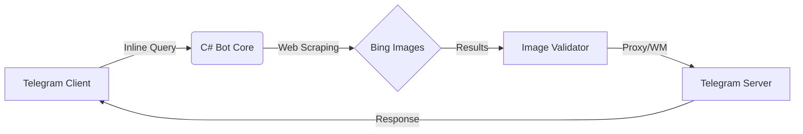

# 🌌 XZ Inline Image Search Bot

<div align="center">


---

**Высокопроизводительный Telegram Inline-бот для мгновенного поиска изображений и GIF.**  
*Построен на .NET Core с любовью к скорости и приватности.*

[🚀 Попробовать](#быстрый-старт) • [🛠 Фичи](#основные-возможности) • [📊 Админка](#админ-мониторинг) • [👨‍💻 Разработчик](https://t.me/Tyta_Zdesyaa777)

</div>

---

## ✨ Основные возможности

> [!TIP]
> Бот работает в **Inline-режиме**. Это значит, что вам не нужно добавлять его в чат — просто введите его имя в поле ввода!

| 🎭 Модуль | 💎 Описание |
| :--- | :--- |
| **🚀 Ultra-Fast Inline** | Мгновенный поиск картинок прямо во время ввода сообщения через `@bot query`. |
| **🎞 GIF Support** | Используйте флаг `--gif` в конце запроса для поиска анимаций. |
| **💧 Watermark Service** | Автоматическое наложение водяных знаков и кэширование через сервера Telegram. |
| **🛡 Image Proxy** | Скрытие оригинальных IP-адресов через встроенный прокси-сервер. |
| **📈 Pro Metrics** | Детальная статистика времени ответа Bing (Average/Min/Max). |
| **📂 Smart Pagination** | Бесконечная подгрузка результатов по мере прокрутки в Telegram. |

---

## 🛠 Технологический стек



*   **Core:** .NET SDK 10.x (C#) — максимальная производительность.
*   **Search Engine:** Bing Search (High-speed parsing).
*   **Networking:** Asynchronous HttpClient with custom headers.
*   **State Management:** JSON-based persistent state with auto-save.

---

## 🚀 Быстрый старт

### 1️⃣ Подготовка окружения
Убедитесь, что у вас установлен **.NET SDK 10.x**.

### 2️⃣ Конфигурация
Создайте файл `.env` в корне проекта:

```ini
# Основные настройки
BOT_TOKEN=123456789:ABCDefgh...
ADMIN_ID=987654321

# Опционально (для проксирования изображений)
PROXY_BASE_URL=https://your-server.com/img?u=
PROXY_PORT=8080
```

### 3️⃣ Запуск
```bash
dotnet run --project XzBotCs/XzBotCs.csproj
```

---

## 🎮 Использование

Просто введите имя бота в любом чате:

*   `@ваш_бот котики` — поиск милых картинок.
*   `@ваш_бот cyberpunk 2077 wallpaper` — поиск обоев.
*   `@ваш_бот dance monkey --gif` — поиск гифок.

---

## 👑 Админ-мониторинг

Бот оснащен мощным инструментом мониторинга через команду `/stats`:

*   **📊 Дашборд:** Визуализация последних 10 запросов в реальном времени.
*   **⏱ Latency:** Отслеживание задержек поискового движка.
*   **⚙️ Live Toggle:** Включение/выключение ватермарки прямо из чата.
*   **📜 Logs:** Мгновенная выгрузка ZIP-архива логов.

---

## 🔒 Безопасность и ответственность

> [!IMPORTANT]
> Бот является инструментом поиска по открытым источникам. Разработчик не несет ответственности за контент, найденный через поисковые системы, и не хранит его на своих серверах.

---

<div align="center">

### ⭐ Понравился проект? Ставь Star!

**Developed by [Tyta_Zdesyaa777](https://t.me/Tyta_Zdesyaa777)**

</div>
