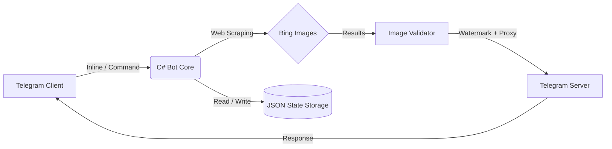

<div align="center">

# ✦ XZ INLINE IMAGE SEARCH BOT ✦

### *— Поиск изображений на скорости мысли —*

<br>


<br>

*Высокопроизводительный Telegram-бот для мгновенного поиска и обработки изображений.*
*Построен на .NET Core — скорость, приватность и безупречная архитектура в каждой строке кода.*

<br>

**[ БЫСТРЫЙ СТАРТ ](#—-быстрый-старт-—)** · **[ ВОЗМОЖНОСТИ ](#—-возможности-—)** · **[ АРХИТЕКТУРА ](#—-архитектура-—)** · **[ АДМИН-ПАНЕЛЬ ](#—-админ-мониторинг-—)** · **[ РАЗРАБОТЧИК ](https://t.me/Tyta_Zdesyaa777)**

</div>

<br>

---

<div align="center">

## — ВОЗМОЖНОСТИ —

</div>

> Бот работает как в **прямом диалоге**, так и в **Inline-режиме** — достаточно ввести его имя в поле ввода любого чата, без необходимости куда-либо его добавлять.

<br>

| Модуль | Описание |
| :---: | :--- |
| **Ultra-Fast Inline** | Мгновенный поиск картинок прямо во время набора сообщения через `@bot query` |
| **GIF Support** | Флаг `--gif` в конце запроса переключает поиск на анимации |
| **Bing Image Search** | Асинхронный поиск через Bing Image Search API с безопасной фильтрацией контента |
| **Watermark Engine** | Наложение водяных знаков: прозрачность, шрифт, позиция, полная поддержка кириллицы |
| **Image Proxy** | Сокрытие первоисточников изображений через встроенный прокси с аутентификацией |
| **Pro Metrics** | Детальная статистика запросов и отправленных изображений по каждому пользователю |
| **Smart Pagination** | До 50 результатов инлайн и до 10 изображений за один текстовый запрос |
| **Persistent State** | Автосохранение настроек и статистики между перезапусками |

<br>

---

<div align="center">

## — КОМАНДЫ БОТА —

</div>

| Команда | Назначение |
| :--- | :--- |
| `/start` | Приветствие и краткая инструкция |
| `/help` | Полная справка по использованию |
| `/stats` | Личная статистика запросов |
| `/search <запрос>` | Поиск изображений по тексту |
| `/watermark <текст>` | Установка собственного водяного знака |
| `/nowatermark` | Отключение водяного знака |
| `/clear` | Очистка истории запросов |

<br>

---

<div align="center">

## — АРХИТЕКТУРА —

*Построена на принципах SOLID, с Dependency Injection и полностью асинхронной обработкой.*

</div>



<br>

<div align="center">

### Ключевые сервисы

</div>

| Файл | Ответственность |
| :--- | :--- |
| `BingSearchService.cs` | Поиск изображений, фильтрация, таймауты, обработка сетевых ошибок |
| `WatermarkService.cs` | Наложение и настройка водяных знаков |
| `BotStatsService.cs` | Подсчёт и хранение статистики использования |
| `InlineQueryHandler.cs` | Обработка inline-запросов и кэширование результатов |
| `CommandHandler.cs` | Диспетчеризация команд бота |
| `UpdateHandler.cs` | Обработка входящих сообщений, ретраи, экранирование |
| `ProxyServer.cs` | HTTP/HTTPS прокси, обход ограничений, автопереподключение |
| `BotState.cs` | Модель персистентного состояния пользователей |
| `AppConfig.cs` | Загрузка конфигурации из переменных окружения |
| `TelegramEscaper.cs` | Экранирование Markdown и спецсимволов |

<br>

---

<div align="center">

## — БЫСТРЫЙ СТАРТ —

</div>

**1. Подготовка окружения**

Убедитесь, что установлен **.NET SDK 10.x**.

**2. Конфигурация**

Создайте файл `.env` в корне проекта:

```ini
# Основные настройки
BOT_TOKEN=123456789:ABCDefgh...
ADMIN_ID=987654321


# Опционально (проксирование изображений)
PROXY_BASE_URL=https://your-server.com/img?u=
PROXY_PORT=8080

# Опционально (водяной знак по умолчанию)
DEFAULT_WATERMARK_TEXT=@ваш_бот
DEFAULT_WATERMARK_OPACITY=0.5
```

**3. Запуск**

```bash
dotnet run --project XzBotCs/XzBotCs.csproj
```

<br>

---

<div align="center">

## — ИСПОЛЬЗОВАНИЕ —

</div>

**Inline-режим** — введите имя бота в любом чате:

```
@ваш_бот котики
@ваш_бот cyberpunk 2077 wallpaper
@ваш_бот dance monkey --gif
```

**Прямой диалог** — отправьте текст боту напрямую, он воспримет его как поисковый запрос и вернёт до 10 изображений с подписями.

<br>

---

<div align="center">

## — АДМИН-МОНИТОРИНГ —

</div>

Через команду `/stats` доступен полноценный инструмент наблюдения за ботом:

- **Дашборд** — визуализация последних запросов в реальном времени
- **Latency** — Average / Min / Max задержки поискового движка
- **Live Toggle** — включение и отключение водяного знака прямо из чата
- **Logs** — мгновенная выгрузка ZIP-архива логов

<br>

---

<div align="center">

## — БЕЗОПАСНОСТЬ И НАДЁЖНОСТЬ —

</div>

- Валидация входных данных и защита от инъекций
- Экранирование пользовательского ввода и спецсимволов Telegram
- Безопасное хранение токенов через переменные окружения
- Graceful degradation и автоматические повторные попытки при сбоях сети
- Логирование операций и уведомления об ошибках

> **Важно.** Бот является инструментом поиска по открытым источникам. Разработчик не несёт ответственности за контент, найденный через поисковые системы, и не хранит его на своих серверах.

<br>

---

<div align="center">

## — КОНТРИБЬЮЦИЯ —

</div>

Любая помощь в развитии проекта приветствуется:

1. Ознакомьтесь с [Руководством для контрибьюторов](CONTRIBUTING.md)
2. Сделайте Fork репозитория
3. Создайте ветку для вашей фичи: `git checkout -b feature/AmazingFeature`
4. Закоммитьте изменения: `git commit -m 'Add some AmazingFeature'`
5. Отправьте ветку: `git push origin feature/AmazingFeature`
6. Откройте Pull Request

<br>

---

<div align="center">

### ✦ Понравился проект — оставь звезду ✦

**Developed by [Tyta_Zdesyaa777](https://t.me/Tyta_Zdesyaa777)**

</div>